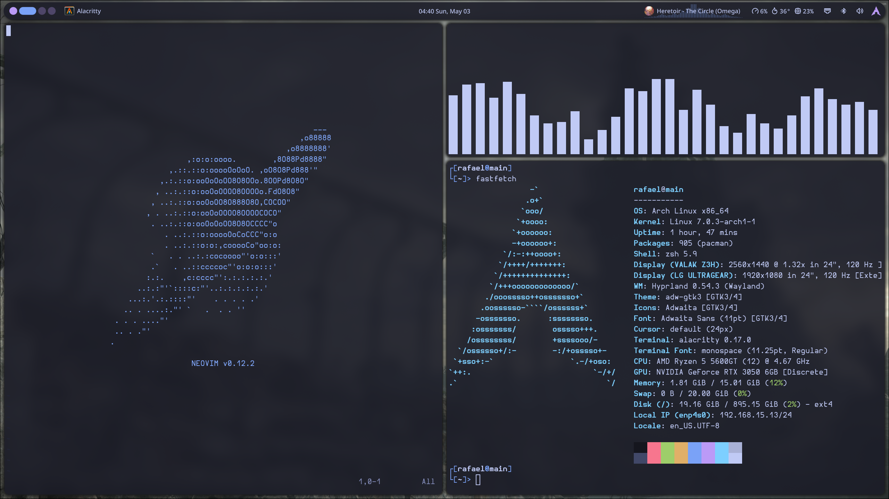
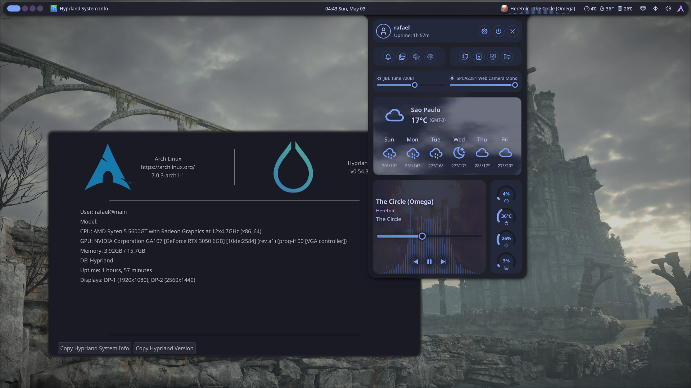
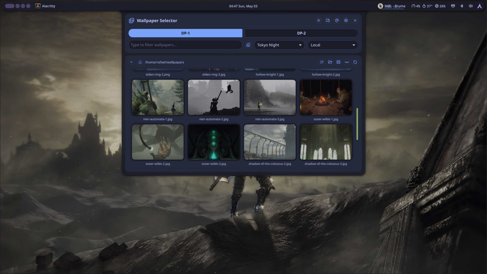

# Rafael Bordoni's dotfiles







My personal Linux ricing. I'm using Hyprland for the compositor, Noctalia for the shell and Qt apps like dolphin, kate, etc for the apps, with the Tokyo Night colorscheme everywhere. There are also configs for Zsh, Neovim and Alacritty, but all four are independent of one another, although they do work well together. It is made for Arch, but might work in other distros if you can find all the packages to install.

There are also some extra stuff that can be configured, like KDE Plasma Tokyo Night colorscheme along with custom keybindings and panels with widgets, a Tokyo Night colorscheme for Godot and bat, and instructions for a cool Firefox setup that matches the desktop.

## Installation

> [!CAUTION]
> The script deletes current config files for whatever you're installing, so make backups if you have to!

> [!IMPORTANT]
> Some of these have dependencies you need to install first, especially the desktop. Read the next sessions for more info on each.

First, download or clone this repo in your home directory. **It must be on the home directory otherwise it won't work!** Then, run the install script with the following arguments, depending on what you're installing but before doing so, make sure you have all the dependencies ready, especially for the desktop.

```bash
./install neovim            # Run this for neovim
./install zsh               # Run this for zsh
./install alacritty         # Run this for alacritty
./install destkop           # Run this for the desktop environment
./install                   # Run this for all of the above

./install neovim destkop    # Run this for both the desktop environment and neovim,
                            # you can add more of the above args to pick and choose
```

### Instructions for Neovim

You need `ripgrep` and `fd`. Having `wl-clipboard` if you're on Wayland might be important too if you want Neovim to share the system clipboard.

```
sudo pacman -S neovim ripgrep fd
./install neovim
```

### Instructions for Zsh

Depends on `fzf`.

```
sudo pacman -S zsh fzf
./install zsh
```

If you are also using Neovim, you can add the following macros to your `.zshrc`:

```
fze() { fzf -m --preview='bat --color=always {}' --bind 'enter:become(nvim {+})'; }
fzd() { cd $(fd -t=d | fzf --preview='ls {}') }
```

You also need `bat` for the first command to work, but you can remove the `--preview` part or replace it with `cat`. There is a Tokyo Night theme for bat here too, see the Extras section. The last command needs `fd`, but you should have it if you installed Neovim.

### Instructions for Alacritty

You need the Hurmit Nerd Font. You can install it from the `nerd-fonts` package along with all other Nerd Fonts or only it directly by installing the `otf-hermit-nerd` package.

```
sudo pacman -S alacritty otf-hermit-nerd
./install alacritty
```

### Instructions for the desktop environment

You need the following packages installed. These names are based on Arch's repository, as well as AUR, so if you're installing on a different distro some of these packages might have a different name.

```
yay -S networkmanager pipewire wireplumber pipewire-alsa noto-fonts hyprland hyprpolkitagent hyprqt6engine xdg-user-dirs xdg-desktop-portal xdg-desktop-portal-hyprland xdg-desktop-portal-kde archlinux-xdg-menu noctalia-shell cliphist wlsunset nwg-look qt5-wayland qt6-wayland adw-gtk-theme xcursor-simp1e-tokyo-night-light udiskie wl-clipboard grim slurp breeze dolphin ark kate gwenview okular haruna kolourpaint kcalc partitionmanager isoimagewriter hyprsysteminfo ksysguard6-git pavucontrol-qt sddm sddm-silent-theme
```

After that, run this so GTK apps get properly themed.

```
gsettings set org.gnome.desktop.interface gtk-theme 'adw-gtk3'
```

You might also want to install and enable bluetooth:

```
sudo pacman -S bluez bluez-utils
sudo systemctl enable bluetooth
```

You also need to run this (with `sudo` so watch it) in order for `dolphin` to correctly open files with the default apps. This is an Arch thing, so you should skip it if you're not on Arch and maybe run something equivalent if `dolphin` can't access `mimeapps.list`.

```
sudo ln -sf /etc/xdg/menus/arch-applications.menu /etc/xdg/menus/applications.menu && kbuildsycoca6 --noincremental
```

With all of that out of the way, you can run the install script. It will create symlinks of the config files here to the correct paths in the your system they need to be, as well as delete the current files they're replacing so, once again, MAKE BACKUPS. Lastly, don't forget these dotfiles repo need to be on your home, like `~/dotfiles/` otherwise it will fail.

```
./install desktop
```

This installation has no terminal emulator included, plus that PC might require additional setup, like monitors, Nvidia and additional window rules and keybindings. Put them on `.config/hypr/custom`.

This setup also doesn't include a terminal emulator, you can install the Alacritty configs if you want. Whichever you pick, you need to set it as your default terminal for `dolphin` to open it. You can do it by adding the following lines on `~/.config/kdeglobals`:

```
[General]
TerminalApplication=<terminal-command-here>
```

Now, we need to setup SDDM. Let's start with the cursor. Edit the `/usr/share/icons/default/index.theme` file with the following contents:

```
[Icon Theme]
Inherits=Simp1e-Tokyo-Night-Light
Size=24
```

Create the `/etc/sddm.conf` with the following contents:

```
[General]
InputMethod=qtvirtualkeyboard
GreeterEnvironment=QML2_IMPORT_PATH=/usr/share/sddm/themes/silent/components/,QT_IM_MODULE=qtvirtualkeyboard

[Theme]
Current=silent
```

Lastly, take one of the wallpapers and copy it into `/usr/share/sddm/themes/silent/backgrounds/` and edit `/usr/share/sddm/themes/silent/configs/default.conf` to replace all `"smoky.jpg"` instances with the copied background.

## Uninstalling

Just run `./uninstall`. And just like the install script, you can also append `neovim`, `zsh`, `alacritty` or `desktop` to uninstall just the configs for said software.

## Updating

Just do `git pull` on this repository and configs for everything you're using will be updated.

## Customizing

Each dotfiles comes with special files that are ignored by this repository to allow you to specific changes without preventing you from updating later with a `git pull`.

### Zsh

It is very useful to have specific aliases on different machines and there is no use keeping everything here on this repository. It is also very common for tools like nvm, rvm, etc to need add some lines to your `.zshrc` or `.bashrc`.

After installing Zsh dotfiles, a `.zshrc` file will be added to your home directory. This file isn't on the repository, so you can change it however you want. All it does is source the dotfiles configs, so whenever you pull you it won't affect your changes on `.zshrc` and the new sourced updated configs should work fine.

### Neovim

Every different machine will probably be working on different projects and thus be using its own different set of LSPs, linters and formatters and there is no point in keeping everything configured in this repository.

After installing Neovim dotfiles, the directory `~/.config/nvim/lua/custom` will be created with the files `lsp-configs.lua`, `none-ls-sources.lua`, `override.lua` and `custom-plugins.lua` just for that. The `override.lua` file will be sourced last on `init.lua` for other changes that might be necessary, like options or mappings. The `custom-plugins.lua` file, as the name suggests, is a file for extra plugins you might want to install. Treat it like any file on `lua/plugins`. The other two are for the LSP configuration, sourced on `lua/plugins/lsp.lua` where you can install your LSPs and do the `none-ls` settings.

### Alacritty

After installing the dotfiles, a `override.toml` file will be added to `~/.config/alacritty/` to change anything, like window opacity, mappings or font.

### The desktop environment

After installing the dotfiles, a `custom.conf` file will be added to `~/.config/hypr/custom/` to add or override any one of the configs. Use to setup monitors on your different machine, integrate your terminal emulator, etc.

The rest aren't really customizable yet, with some exceptions. The install script symlinks some files and just copies others. The ones that are not symlinked will not affect this repo, and thus will not be updated on a `git pull`, unlike the symlinked ones. The symlinked ones are Noctalia and the GTK folders, while the Qt apps rc files will be copied.

## Extras

### KDE Plasma

Run the following:

```
cp ~/dotfiles/extras/plasma/kglobalshortcutsrc ~/.config/
cp ~/dotfiles/extras/plasma/kxkbrc ~/.config/
cp ~/dotfiles/extras/plasma/plasmashellrc ~/.config/
cp ~/dotfiles/extras/plasma/plasma-org.kde.plasma.desktop-appletsrc ~/.config/
cp ~/dotfiles/.XCompose ~/
```

After that, use the [TokyoNight.colors](TokyoNight.colors) file on the Settings to import a colorscheme and set it with Breeze. You can also set `~/dotfiles/wallpapers/` as the wallpapers directory for slideshow mode, with 15 minutes to between wallpapers.

### Godot Engine

There's a Godot Game Engine editor saved theme and layout, just put the files in [extras/godot](extras/godot) at `~/.config/godot`. It's basically Tokyo Night Godot, as well as my own personal layout.

### Firefox

No files contained here, but for a Tokyo Night themed Firefox, use [this theme](https://addons.mozilla.org/en-US/firefox/addon/tokyo-night-milav/). If you're on the desktop configs contained here, might as well install [FF-ULTIMA](https://github.com/soulhotel/FF-ULTIMA) as well and set `ultima.disable.windowcontrols.button = false`, `ultima.navbar.hide.buttons = false`, `ultima.tabs.tabCounter = false`, `ultima.urlbar.centered = false` and `browser.tabs.insertAfterCurrent = false`.
