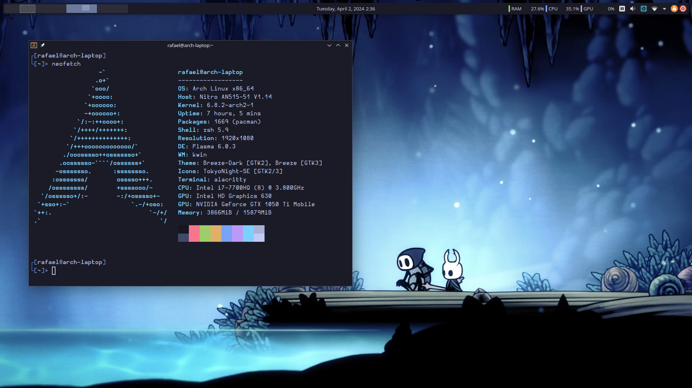
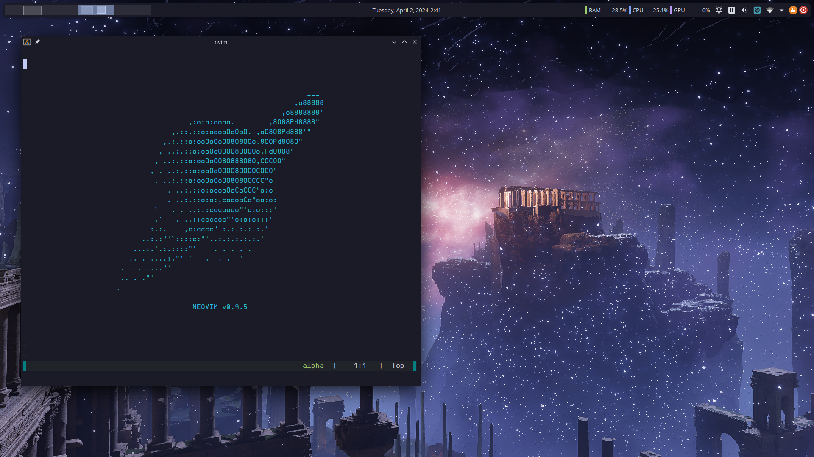

# Rafael Bordoni's dotfiles

My personal Linux ricing. Configurations for [KDE Plasma 6](https://kde.org/plasma-desktop/), [neovim](https://neovim.io), [alacritty](https://alacritty.org/) and [zsh](https://wiki.archlinux.org/title/zsh). It tries to be very minimal, with no plugins or scripts for [Plasma](https://kde.org/plasma-desktop/) except for a single [colorscheme](TokyoNight.colors). For [neovim](https://neovim.io), there's [ripgrep](https://github.com/BurntSushi/ripgrep) and [fd](https://github.com/sharkdp/fd) for [telescope](https://github.com/nvim-telescope/telescope.nvim). For [zsh](https://wiki.archlinux.org/title/zsh), you need [oh-my-zsh](https://ohmyz.sh/) and for [alacritty](https://alacritty.org/), there's a single font already bundled on the [Plasma](https://kde.org/plasma-desktop/) configs, but you can install it through `pacman` with `sudo pacman -S otf-hermit-nerd`.

The colorscheme is a slightly modified version from [this one](https://github.com/Jayy-Dev/Plasma-Tokyo-Night/blob/plasma-6/colorscheme/TokyoNight.colors), just making the window title bars the same color as the usual background so it blends in with the terminal background and other apps.

Yes, this whole repository is just Tokyo Night, the DE. If you don't know the Tokyo Night theme, it's [this](https://github.com/folke/tokyonight.nvim) popular [neovim](https://neovim.io) theme. This repository has ports of this theme to many other popular open source software, including [alacritty](https://alacritty.org/) which is included here.

## Dependencies

For [KDE Plasma](https://kde.org/plasma-desktop/), you need [konsave](https://github.com/Prayag2/konsave) just to install the dotfiles, you can remove it afterwards.

For [neovim](https://neovim.io), you need [ripgrep](https://github.com/BurntSushi/ripgrep) and [fd](https://github.com/sharkdp/fd).

For [zsh](https://wiki.archlinux.org/title/zsh), you need [oh-my-zsh](https://ohmyz.sh/).

For [alacritty](https://alacritty.org/), you need the [HurmitNerdFont](Hermit.zip), but it already comes on the [KDE Plasma](https://kde.org/plasma-desktop/) settings so you don't need to install it if you install [KDE](https://kde.org/plasma-desktop/) config files too.

I'm also including the [colorscheme](TokyoNight.colors) in case you want to use it on your own [Plasma](https://kde.org/plasma-desktop/) configs without needing to extract it from mine.

## Installation

First, clone or download this repository into your home directory. It must be on the home directory. Don't forget to have all the dependencies for the dotfiles you'll install ready before doing that.

To install, run the `install.sh` script in this repository. You can also append `kde`, `neovim`, `zsh` or `alacritty` to `sh install.sh` to install just the configurations for said tool, for example running `sh install.sh neovim` will just install the [neovim](https://neovim.io) configurations. You can install two too by doing `sh install.sh neovim alacritty`, for example. Running `sh install.sh` is the same as `sh install neovim alacritty zsh kde`. __NOTE:__ If you are installing [alacritty](https://alacritty.org/) but are not using [KDE Plasma](https://kde.org/plasma-deskotp/), install the [HurmitNerdFont](Hermit.zip) on your system (can be installed with `sudo pacman -S otf-hermit-nerd` if on Arch, but the file is here in case you're in another distro).

## Uninstalling

For everything except [KDE Plasma](https://kde.org/plasma-desktop/), Just run `sh uninstall.sh`. And just like the install script, you can also append `neovim`, `zsh` or `alacritty` to uninstall just the configs for said software, but doesn't work for [KDE](https://kde.org/plasma-desktop/). See [konsave](https://github.com/Prayag2/konsave) for how to backup your own config before applying these.

## Updating

Just do `git pull` on this repository and configs for everything you're using will be updated. You'll have to run the [konsave](https://github.com/Prayag2/konsave) commands to update [KDE Plasma](http://kde.org/plasma-desktop/), the same ones on the installation section.

There is also the script [update.sh](kde/update.sh) to save the [KDE Plasma](https://kde.org/plasma-desktop/) profile and split it into the chunks to be uploadable to github. This is mostly for me, to make it easier for me to update the profile on this repo but you can take that script too.

## Customizing

Each dotfiles come with special files that are ignored by this repository to allow you to specific changes without preventing you from updating later with a `git pull`.

### Zsh

It is very useful to have specific aliases on different machines and there is no use keeping everything here on this repository. It is also very common for tools like nvm, rvm, etc to need add some lines to your `.zshrc` or `.bashrc`.

After installing [zsh](https://wiki.archlinux.org/title/zsh) dotfiles, a `.zshrc` file will be added to your home directory. This file isn't on the repository, so you can change it however you want. All it does is source the dotfiles configs, so whenever you pull you it won't affect your changes on `.zshrc` and the new sourced updated configs should work fine.

### Neovim

Every different machine will probably be working on different projects and thus be using its own different set of LSPs, linters and formatters and there is no point in keeping everything configured in this repository.

After installing [neovim](https://neovim.io) dotfiles, the directory `~/.config/nvim/lua/custom` will be created with the files `lsp-configs.lua`, `none-ls-sources.lua`, `override.lua` and `custom-plugins.lua` just for that. The `override.lua` file will be sourced last on `init.lua` for other changes that might be necessary, like options or mappings. The `custom-plugins.lua` file, as the name suggests, is a file for extra plugins you might want to install. Treat it like any file on `lua/plugins`. The other two are for the LSP configuration, sourced on `lua/plugins/lsp.lua` where you can install your LSPs and do the `none-ls` settings.

### Alacritty

After installing the dotfiles, a `override.toml` file will be added to `~/.config/alacritty/` to change anything, like window opacity, mappings or font.

### KDE Plasma

These are not in this repository, so you can mess around and change your settings without git seeing anything. You can run `konsave -a eldskald` to re-apply them back, or just `sh install.sh kde` should work too.

## Extras

### Godot Engine

There's a [Godot](https://godotengine.org/) editor saved theme and layout, just put the files in [extras/godot](extras/godot) at `~/.config/godot`. It's basically Tokyo Night Godot, as well as my own personal layout.

### bat

There's a Tokyo Night theme [bat](https://github.com/sharkdp/bat), just read [this section](https://github.com/sharkdp/bat#adding-new-themes) on how to add themes after downloading [extras/bat/tokyonight_night.tmTheme](extras/bat/tokyonight_night.tmTheme).
